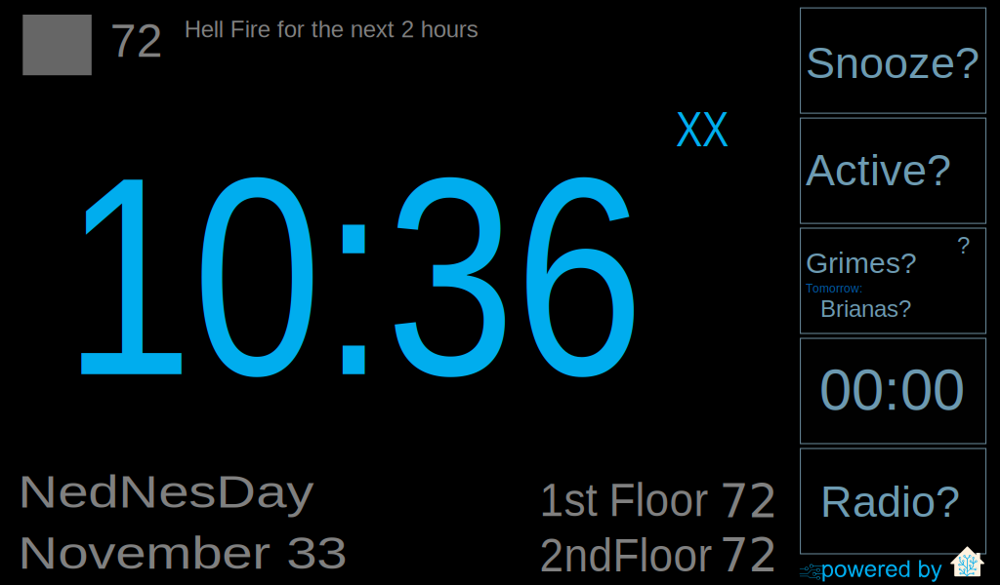

# Home Assistant Config

This is my [Home Assistant](https://home-assistant.io/) configuration. Lot's in
here. Here are some highlights:

## Announce Known Callers

We get a lot of calls from telemarketers, so we use Home Assistant to play a
ringtone on our in house speakers when we receive a call, *if* we recognize
the incoming phone number.

It something of a complicated setup but here goes: A USB modem to monitors
incoming phone calls (sensor/modem.yaml).  When a call is received an
automation (automations/callerid.yaml) fires off the
`shell_command.notify_if_known` service (shell\_commands/callerid.yaml and
bin/notify-if-known.sh). If the number is listed in an SQLite datates (checked
by bin/check-is-known.py) then we publish a message to MQTT.

A script (mqtt-say) monitors MQTT for messages and plays a .mp3 or makes a TTS
announcement. Last, I use another script to pull my contacts from Google
Contacts and store them in the SQLite database.

- [packages/callerid.yaml](packages/callerid.yaml)
- [bin/check-is-known.py*](bin/check-is-known.py*)
- [bin/notify-if-known.sh*](bin/notify-if-known.sh*)
- mqtt-say (TODO: release/document)
- Google contact script (TODO: release/document)

## Floorplan

I am running three different (floorplan)[https://github.com/pkozul/ha-floorplan]
some of these are a work-in-process. All of these require a the fully kiosk
version of (flooplan)[https://github.com/pkozul/ha-floorplan-kiosk]

### House

- [custom_panels/home.yaml](custom_panels/home.yaml) - define the panel
- [panels/home.html](panels/home.html) - the Polymer Component (mostly
  stock)
- [www/custom_ui/floorplan/home.yaml](www/custom_ui/floorplan/floorhome.yaml) - floorplan
  config that specifies the home.yaml page
- [www/custom_ui/floorplan/home.yaml](www/custom_ui/floorplan/home.yaml) -
  home.yaml page; primary floorplan integrations
- [www/custom_ui/floorplan/home.css](www/custom_ui/floorplan/home.css)
- [www/custom_ui/floorplan/home.svg](www/custom_ui/floorplan/home.svg)

### Clock

Files:

- [custom_panels/clock.yaml](custom_panels/clock.yaml) - define the panel
- [packages/clock.yaml](packages/clock.yaml) - custom sensors and automations
- [panels/clock.html](panels/clock.html) - the Polymer Component (mostly
  stock)
- [www/custom_ui/floorplan/clock.yaml](www/custom_ui/floorplan/floorclock.yaml) - floorplan
  config that specifies the clock.yaml page
- [www/custom_ui/floorplan/clock.yaml](www/custom_ui/floorplan/clock.yaml) -
  clock.yaml page; primary floorplan integrations
- [www/custom_ui/floorplan/clock.css](www/custom_ui/floorplan/clock.css)
- [www/custom_ui/floorplan/clock.svg](www/custom_ui/floorplan/clock.svg)

### Pets

- [custom_panels/pets.yaml](custom_panels/pets.yaml) - define the panel
- [packages/pets.yaml](packages/pets.yaml) - custom sensors and automations
- [panels/pets.html](panels/pets.html) - the Polymer Component (mostly
  stock)
- [www/custom_ui/floorplan/pets.yaml](www/custom_ui/floorplan/floorpets.yaml) - floorplan
  config that specifies the pets.yaml page
- [www/custom_ui/floorplan/pets.yaml](www/custom_ui/floorplan/pets.yaml) -
  pets.yaml page; primary floorplan integrations
- [www/custom_ui/floorplan/pets.css](www/custom_ui/floorplan/pets.css)
- [www/custom_ui/floorplan/pets.svg](www/custom_ui/floorplan/pets.svg)

## Multiple Views

I've created a simplified [default_view](groups/default-view.yaml) and put all
the rest of my components in different views (groups/\*<name>-view.yaml).

## Others

A few other things that I'm really happy with and would like to document more:

- Alexa routines [scripts/welcome.yaml](scripts/welcome.yaml)
- Family room DIY switch and automations
  [automations/family-room-lights.yaml](automations/family-room-lights.yaml)
- Basement lights
- Vacation mode

## Hardware/Software

- Home Assistant runs on Arch Linux in a KVM 
- SmartThings MQTT Bridge in a Docker container
- 5+ x TP-Link Plugs
- 2 x TP-Link Switches
- 1 x WeMo Smart Dimmer Switch
- Several NodeMCU based DIY sensors (TODO: document)
- One NodeMCU base DIY switch (TODO: document)
- A SmartThings HUB to connect to various Z-Wave/ZigBee devices 
- mqtt-say (TODO: document)
