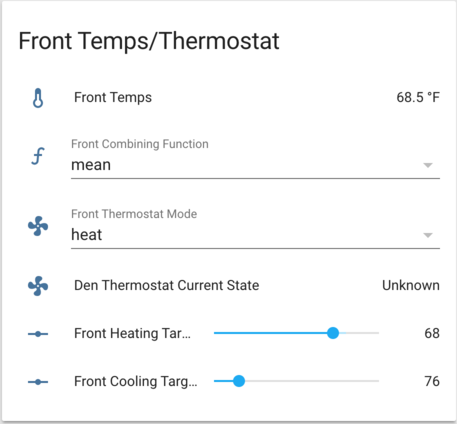

# Home Assistant Config

This is my [Home Assistant](https://home-assistant.io/) configuration. Lot's in
here. Here are some highlights:

  * [Announce Known Callers](#announce-known-callers)
  * [Floorplan](#floorplan)
    + [House](#house)
    + [Morning Status Panel](#morning-status-panel)
    + [Pets](#pets)
  * [HVAC](#hvac)
  * [Multiple Views](#multiple-views)
  * [Alexa](#alexa)
  * [Others](#others)
  * [Hardware/Software](#hardware-software)

## Announce Known Callers

We get a lot of calls from telemarketers, so we use Home Assistant to play a
ringtone on our in house speakers when we receive a call, *if* we recognize
the incoming phone number.

It something of a complicated setup but here goes: A USB modem to monitors
incoming phone calls (sensor/modem.yaml).  When a call is received an
automation (automations/callerid.yaml) fires off the
`shell_command.notify_if_known` service (shell\_commands/callerid.yaml and
bin/notify-if-known.sh). If the number is listed in an SQLite datates (checked
by bin/check-is-known.py) then we publish a message to MQTT.

A script (mqtt-say) monitors MQTT for messages and plays a .mp3 or makes a TTS
announcement. Last, I use another script to pull my contacts from Google
Contacts and store them in the SQLite database.

- [packages/callerid.yaml](packages/callerid.yaml)
- [bin/check-is-known.py*](bin/check-is-known.py*)
- [bin/notify-if-known.sh*](bin/notify-if-known.sh*)
- mqtt-say](https://github.com/mvgrimes/mqtt-say)
- Google contact script (TODO: release/document)

## Floorplan

I am running three different (floorplan)[https://github.com/pkozul/ha-floorplan]
some of these are a work-in-process. All of these require a the fully kiosk
version of (flooplan)[https://github.com/pkozul/ha-floorplan-kiosk]

### House

- [custom_panels/home.yaml](custom_panels/home.yaml) - define the panel
- [panels/home.html](panels/home.html) - the Polymer Component (mostly
  stock)
- [www/custom_ui/floorplan/home.yaml](www/custom_ui/floorplan/floorhome.yaml) - floorplan
  config that specifies the home.yaml page
- [www/custom_ui/floorplan/home.yaml](www/custom_ui/floorplan/home.yaml) -
  home.yaml page; primary floorplan integrations
- [www/custom_ui/floorplan/home.css](www/custom_ui/floorplan/home.css)
- [www/custom_ui/floorplan/home.svg](www/custom_ui/floorplan/home.svg)

### Morning Status Panel

Files:

- [custom_panels/status.yaml](custom_panels/status.yaml) - define the panel
- [packages/status.yaml](packages/status.yaml) - custom sensors and automations
- [panels/status.html](panels/status.html) - the Polymer Component (mostly
  stock)
- [www/custom_ui/floorplan/status.yaml](www/custom_ui/floorplan/floorstatus.yaml) - floorplan
  config that specifies the status.yaml page
- [www/custom_ui/floorplan/status.yaml](www/custom_ui/floorplan/status.yaml) -
  status.yaml page; primary floorplan integrations
- [www/custom_ui/floorplan/status.css](www/custom_ui/floorplan/status.css)
- [www/custom_ui/floorplan/status.svg](www/custom_ui/floorplan/status.svg)

This replaces my previous super clock floorplan. The clock was nice, but my
Amzaon Fire Tablet wouldn't stay connected to HA consistently enough for me to
rely on it as an alarm clock and the dimmed (but not off) screen was too bright
to keep next to the bed. This presents a bunch of info that I find useful in
the morning (date, weather, temps and who's turn it is to drive carpool).

### Pets

- [custom_panels/pets.yaml](custom_panels/pets.yaml) - define the panel
- [packages/pets.yaml](packages/pets.yaml) - custom sensors and automations
- [panels/pets.html](panels/pets.html) - the Polymer Component (mostly
  stock)
- [www/custom_ui/floorplan/pets.yaml](www/custom_ui/floorplan/floorpets.yaml) - floorplan
  config that specifies the pets.yaml page
- [www/custom_ui/floorplan/pets.yaml](www/custom_ui/floorplan/pets.yaml) -
  pets.yaml page; primary floorplan integrations
- [www/custom_ui/floorplan/pets.css](www/custom_ui/floorplan/pets.css)
- [www/custom_ui/floorplan/pets.svg](www/custom_ui/floorplan/pets.svg)

## HVAC

Our furnace and A/C unit services rooms on multiple floors, so a single
temperature reading at the thermostat is never useful. HA uses multiple
temperature sensors, some `input_boolean` occupancy sensors and a "combining
function" to calculate the effective or virtual temperature, then adjusts the
thermostat target as appropriate.

In one group, we can see the _effective_ temperature, the combining function
(min, max or mean), heat/cool, and the targets.

Another group shows the actual thermostat. These heating/cooling targets are
continually adjusted to keep the heat or A/C on as long as the virtual
temperature hasn't met the desired target.

Simple `input_boolean`s are use to designate rooms as occupied. The temperature
measurement from that room is included in the virtual temperature calculation,
only if it is occupied. For now, the occupancy sensors are either manually
toggled or toggled by automations (ie, we assume the kitchen isn't occupied at
night). We could use PIR/Bluetooth/etc to sense actual presense in rooms but
haven't.

The last group contains heating/cooling targets for different modes. For
example, when "Away" mode is active, the front heating target should adjust to
62°F. Having these as `input_numbers` instead of hard-coded in the automation
should make updating this much more friendly.

## Multiple Views

I've created a simplified [default_view](groups/default-view.yaml) and put all
the rest of my components in different views (groups/\*<name>-view.yaml).

## Alexa

Two different Alexa integrations:

1. emulated\_hue -- the echo looks for devices on the network (as presented by
   HA over port 8300) and exposes them as "Smart Home" devices.

2. alexa -- a custom skill (invoked by "Alexa, ask Home Assistant...") is
   created in Amazon's Alexa Skills Kit console and the interaction model is
   defined. The skill forwards actions to:

       https://hass.markandcarrie.com/api/alexa?api_password=XXXX

  Intent scripts are defined in the intent\_script/ directory.

## Others

A few other things that I'm really happy with and would like to document more:

- Alexa routines [scripts/welcome.yaml](scripts/welcome.yaml)
- Family room DIY switch and automations
  [automations/family-room-lights.yaml](automations/family-room-lights.yaml)
- Basement lights
- Vacation mode

## Hardware/Software

- Home Assistant runs on Arch Linux in a KVM 
- SmartThings MQTT Bridge in a Docker container
- 5+ x TP-Link Plugs
- 2 x TP-Link Switches
- 1 x WeMo Smart Dimmer Switch
- Several NodeMCU based DIY sensors (TODO: document)
- One NodeMCU base DIY switch (TODO: document)
- A SmartThings HUB to connect to various Z-Wave/ZigBee devices 
- mqtt-say (TODO: document)

<small><i><a href='http://ecotrust-canada.github.io/markdown-toc/'>Table of contents generated with markdown-toc</a></i></small>
